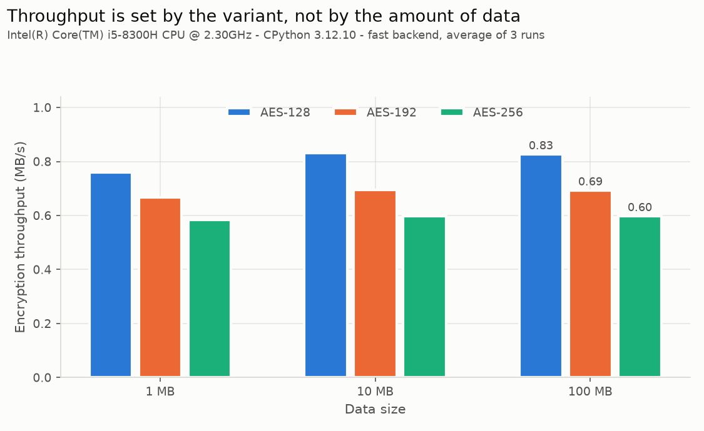
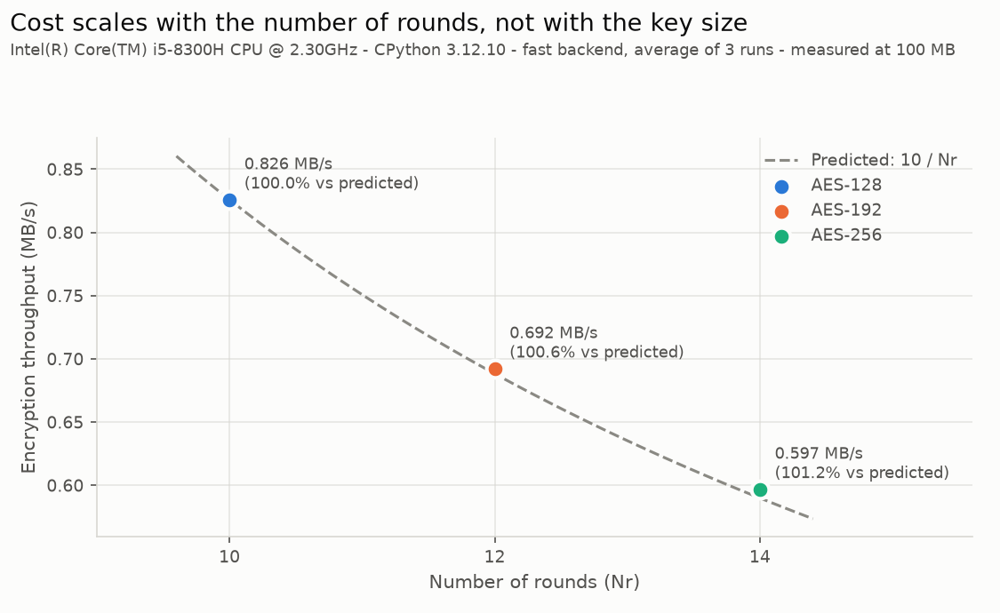
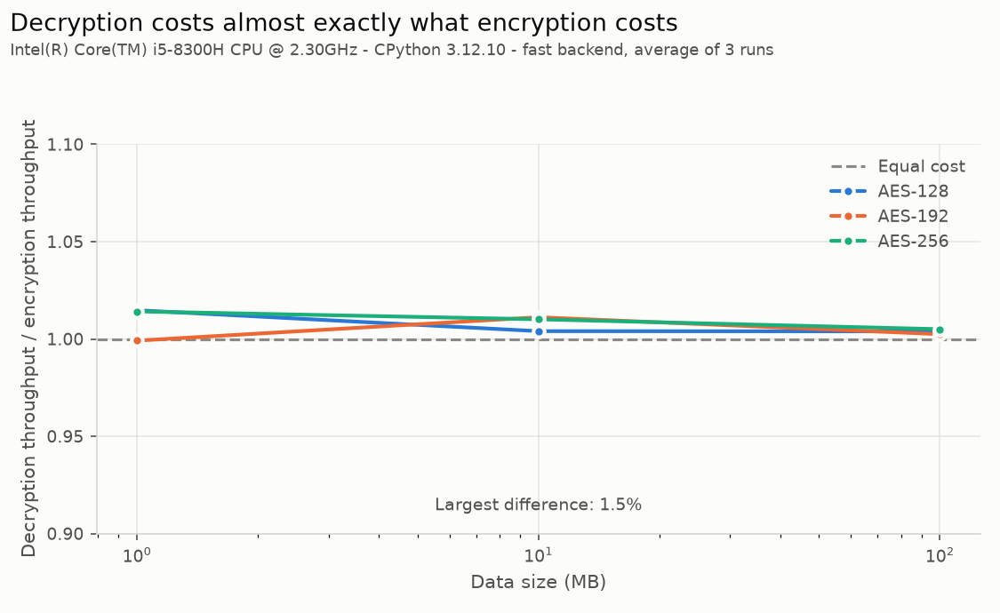
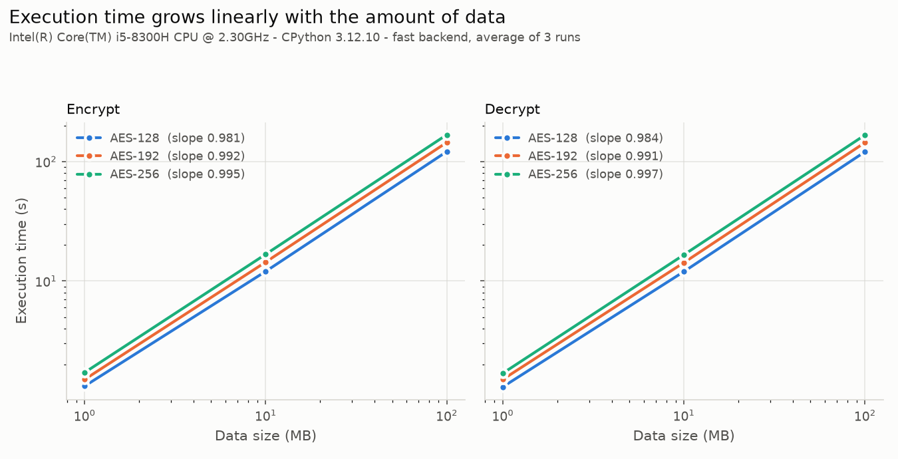

# Laboratory 3 — AES implementation and evaluation

**Cryptography · Technical report**

---

## 1. Implementation

### 1.1 Structure

The core is the package `aeslib`, built in layers, each resting only on the one
below it:

| Module | Responsibility |
|---|---|
| `gf.py` | arithmetic in GF(2⁸) modulo x⁸+x⁴+x³+x+1 |
| `sbox.py` | S-box and inverse S-box |
| `state.py` | the 128-bit state, 4×4 column-major |
| `transforms.py` | SubBytes, ShiftRows, MixColumns, AddRoundKey, and inverses |
| `key_schedule.py` | expansion for Nk = 4, 6, 8 |
| `cipher.py` | Cipher and InvCipher |
| `fast.py` | table-driven backend |
| `api.py` | the `AES` class |

The dependency graph is acyclic and one-directional. `aeslib` imports nothing
from `tests` or `benchmarks`, and nothing outside the Python standard library.

### 1.2 Decisions worth defending

**No cryptographic constant is written by hand.** The S-box is produced by
inverting each byte in GF(2⁸) and applying the affine transformation; the
inverse S-box is obtained by inverting that permutation, so the two cannot
disagree; the round constants are successive powers of x computed with `xtime`;
the eight lookup tables of the fast backend are built from the S-box and the
MixColumns matrices. Construction costs 13 ms once, at import, and nothing
afterwards — the resulting tables are the same objects that pasted constants
would produce.

The motivation is not elegance but testability. The published tables live only
in `tests/vectors.py`. Because the implementation and the oracle are produced by
different routes, their agreement on all 256 entries is evidence; had the table
been pasted into both, the test would only compare a file with itself.

**MixColumns and InvMixColumns share one routine.** Both are a product by a
fixed 4×4 matrix over GF(2⁸), so `_mix_columns_with(state, matrix)` is
parameterised by the matrix. The forward and inverse steps cannot drift apart.
The fast backend derives its tables from those same matrix constants.

**One key schedule serves the three variants.** The expansion is parameterised
by Nk, with Nr = Nk + 6. The only branch that depends on the key size is the
additional `SubWord` applied when Nk > 6, which is what distinguishes AES-256.
Round keys are read as a flat stream of words, so AES-192 — whose six-word key
does not align with four-word round keys — needs no special case.

**Two backends compute the same function.** `cipher.py` follows FIPS-197 one
named transformation at a time. It reaches 0.018 MB/s, which puts a single
100 MB pass at about ninety minutes and makes the required benchmark
impractical. `fast.py` folds SubBytes, ShiftRows and MixColumns of a round into
four table lookups and three XORs per column, reaching 0.83 MB/s — a factor of
45. Its decryption uses the equivalent inverse cipher of FIPS-197 §5.3.5, which
applies InvMixColumns to the intermediate round keys so that the decryption loop
has the same shape as encryption.

Using the fast backend for the measurements is a claim that needs justification,
and §2.3 supplies it.

---

## 2. Validation

### 2.1 The suite

1649 tests, 7 seconds, all passing before any measurement was taken.

| File | Tests | Covers |
|---|---|---|
| `test_gf.py` | 1037 | field axioms, inverses, the generator |
| `test_sbox.py` | 18 | the S-box against FIPS-197, and its design properties |
| `test_state.py` | 60 | the column-major layout |
| `test_transforms.py` | 177 | the round transformations and their inverses |
| `test_key_schedule.py` | 54 | the expansion for the three key sizes |
| `test_cipher.py` | 132 | the published vectors, D(E(P)) = P, avalanche |
| `test_backends.py` | 72 | equivalence of the two backends |
| `test_benchmark.py` | 29 | the measurement harness |
| `test_plots.py` | 8 | the figures |

The field laws are checked exhaustively over all 256 elements rather than
sampled, which makes those tests proofs rather than spot checks. Associativity
and distributivity, which would need 2²⁴ combinations, use a fixed
pseudo-random sample of 500 triples.

### 2.2 Test-vector results

| Source | AES-128 | AES-192 | AES-256 |
|---|---|---|---|
| FIPS-197 Figure 7 / 14 (S-box) | ✓ | — | — |
| FIPS-197 Appendix A (key expansion) | ✓ full | ✓ final key | ✓ final key |
| FIPS-197 Appendix B (round-1 trace) | ✓ | — | — |
| FIPS-197 Appendix C (one block) | ✓ | ✓ | ✓ |
| NIST SP 800-38A F.1 (ECB, four blocks) | ✓ | ✓ | ✓ |

Three of these deserve comment.

The **Appendix B trace** fixes SubBytes, ShiftRows and MixColumns individually.
Because the output of each step is the input of the next, the three transcribed
values must agree with one another as well as with the implementation.

The **final round key of AES-256** is the value that proves the extra `SubWord`
is applied. An implementation missing that branch still produces an expansion of
the correct length, and diverges long before the last key.

The **SP 800-38A vectors** use the keys of Appendix A. A failure there on a key
that already passed the key-schedule tests would point at the cipher rather than
at the expansion.

### 2.3 Equivalence of the backends

The benchmark runs on the fast backend, so the suite requires that, for the
three key sizes, in both directions, over buffers of 1 to 32 blocks and on
all-zero and all-ones inputs, it produces the same bytes as the reference core.
A stronger property is also required: the two are interchangeable mid-operation,
each decrypting what the other encrypted.

Because both backends share `gf`, `sbox` and the MixColumns matrices, they are
not fully independent, and agreement alone would not exclude a shared error. The
fast backend is therefore checked against the published vectors directly as
well, and the 8192 bytes of its eight tables are rebuilt from `gf.mul` and
compared entry by entry.

### 2.4 A defect the tests caught

The first version of the fast backend built its tables from the **rows** of the
MixColumns matrix. Table *j* must hold the contribution of input byte *j* to all
four outputs, which is **column** *j*. The error produced a self-consistent
cipher that failed every published vector immediately. The fix was to derive the
columns from the matrix constants already used by the reference implementation,
removing the duplication that allowed the mistake.

---

## 3. Experimental setup

| | |
|---|---|
| CPU | Intel Core i5-8300H @ 2.30 GHz, 8 logical cores |
| Platform | Windows 11 (10.0.26200) |
| Python | CPython 3.12.10 |
| Backend | `fast` |
| Data sizes | 1, 10, 100 MB |
| Repetitions | 3 per measurement, averaged |
| Timing | `time.perf_counter` |

### 3.1 Procedure

Throughput is R = D / T, with D in megabytes and T in seconds.

The key schedule runs once, in the `AES` constructor, **outside the timed
region**: Exercise 3 concerns the cost of the core, and a key is prepared once
per session while blocks are processed by the million. The data buffer is
generated before the clock starts, so `os.urandom` never enters a measurement. A
garbage collection is forced before each repetition, so that a collection during
a measurement is not charged to the cipher.

Every repetition decrypts what it has just encrypted and verifies that the
plaintext returns. Correctness is therefore confirmed while the numbers are
taken; measuring a wrong implementation would be meaningless.

The blocks are processed independently, which is raw ECB. As the assignment
states, this evaluates the cryptographic core and is not a secure mode of
operation.

### 3.2 Rejecting contaminated measurements

A first attempt produced this for AES-256 at 100 MB:

```
encrypt:    165.0 s    3597.7 s    3593.1 s
decrypt:  11076.7 s    3624.2 s    4553.6 s
```

The first encryption, 165.0 s, is exactly what the round counts predict from the
AES-192 measurement. The rest is not computation: 11 076 s is three hours during
which the process was not running. Wall-clock time, which throughput is defined
on, also counts time the machine spends suspended or busy elsewhere.

The harness now records CPU time alongside wall-clock time and computes, for
each timed interval, the fraction spent off the processor. A measurement losing
more than 20 % of an interval — or more than a fixed 0.25 s allowance on short
intervals, where the ~15 ms granularity of the Windows CPU clock would otherwise
dominate — is refused. The run then **writes nothing** and reports which
measurements were affected.

The reported run lost at most **2.0 %** of any interval.

---

## 4. Results and analysis

### 4.1 Measurements

**Encryption**

| Data | AES-128 | AES-192 | AES-256 |
|---|---|---|---|
| 1 MB | 1.32 s — 0.758 MB/s | 1.50 s — 0.667 MB/s | 1.71 s — 0.584 MB/s |
| 10 MB | 12.03 s — 0.831 MB/s | 14.40 s — 0.694 MB/s | 16.74 s — 0.598 MB/s |
| 100 MB | 121.07 s — 0.826 MB/s | 144.44 s — 0.692 MB/s | 167.51 s — 0.597 MB/s |

**Decryption**

| Data | AES-128 | AES-192 | AES-256 |
|---|---|---|---|
| 1 MB | 1.30 s — 0.770 MB/s | 1.50 s — 0.666 MB/s | 1.69 s — 0.592 MB/s |
| 10 MB | 11.99 s — 0.834 MB/s | 14.24 s — 0.702 MB/s | 16.57 s — 0.604 MB/s |
| 100 MB | 120.60 s — 0.829 MB/s | 144.09 s — 0.694 MB/s | 166.67 s — 0.600 MB/s |

Standard deviations over the three repetitions stay below 0.8 s at 100 MB, that
is under 0.6 % of the mean.

### 4.2 Difference among the three variants



At 100 MB, AES-192 delivers 83.8 % of the throughput of AES-128 and AES-256
delivers 72.3 %. Equivalently, encrypting the same data costs 19.3 % more with
AES-192 and 38.4 % more with AES-256. The ordering is identical at every size
and in both directions.

### 4.3 Effect of the number of rounds



This is the central result. If the variants differ only in how many rounds they
run, throughput should fall as 10/Nr relative to AES-128:

| Data | AES-192 measured | 10/12 | deviation | AES-256 measured | 10/14 | deviation |
|---|---|---|---|---|---|---|
| 1 MB | 0.879 | 0.833 | +5.53 % | 0.769 | 0.714 | +7.73 % |
| 10 MB | 0.836 | 0.833 | +0.27 % | 0.719 | 0.714 | +0.67 % |
| 100 MB | 0.838 | 0.833 | +0.58 % | 0.723 | 0.714 | +1.19 % |

At 10 and 100 MB the prediction holds to within about 1 %.

Normalising makes the point sharper. Dividing the cost of one block by the
number of rounds at 100 MB:

| Variant | µs per block | µs per round per block |
|---|---|---|
| AES-128 | 18.474 | **1.8474** |
| AES-192 | 22.040 | **1.8367** |
| AES-256 | 25.560 | **1.8257** |

The three variants collapse onto the same number within 1.2 %. The round is the
unit of cost, and the variants differ in how many they execute — not in what a
round costs.

The residual downward drift, about 0.6 % from AES-128 to AES-256, is consistent
with the per-call overhead outside the round loop being amortised over more
rounds in the longer variants.

### 4.4 Encryption against decryption



Decryption throughput averaged over all sizes is 1.0075, 1.0042 and 1.0097 times
encryption throughput for AES-128, AES-192 and AES-256. The largest single
difference is 1.5 %, comparable to the spread between repetitions, so the two
directions cost the same within the resolution of the experiment.

This is a consequence of the equivalent inverse cipher. The straightforward
inverse cipher alternates AddRoundKey and InvMixColumns in an order that cannot
be folded into tables and would be measurably slower; moving InvMixColumns onto
the round keys gives decryption the same loop as encryption. Its extra cost —
transforming Nr−1 round keys once per call — is 13 blocks' worth of work,
invisible against the 6.5 million blocks of a 100 MB buffer.

That the two directions match so closely is itself a validation: they exercise
different tables and a different key schedule.

### 4.5 Effect of the data size



Fitting log(time) against log(size) gives slopes of 0.9815, 0.9919 and 0.9951
for encryption and 0.9838, 0.9912 and 0.9970 for decryption. A slope of exactly
1 would mean cost strictly proportional to data.

The slopes fall slightly short of 1 because throughput *improves* with size:

| Variant | 1 MB | 100 MB | change |
|---|---|---|---|
| AES-128 | 0.758 | 0.826 MB/s | +8.9 % |
| AES-192 | 0.667 | 0.692 MB/s | +3.8 % |
| AES-256 | 0.584 | 0.597 MB/s | +2.3 % |

The gain is a fixed per-call cost — argument checking, converting the key
schedule to words, allocating the output buffer — being spread over more data.
It is largest for AES-128, whose 1 MB run is the shortest and therefore the one
where a constant weighs most. Between 10 and 100 MB throughput is flat to within
0.6 %: by 10 MB the constant has already been absorbed.

This also explains the 1 MB row of §4.3. The deviations of +5.53 % and +7.73 %
are not a failure of the rounds model but the same per-call overhead, which
shifts AES-128 more than the others and so distorts every ratio taken against
it. **Conclusions about relative cost should be drawn from the 10 and 100 MB
measurements**, where that artefact has disappeared.

### 4.6 Key size against computational cost

The cost is not paid for the key size but for the rounds that the key size
brings. A 256-bit key is twice the length of a 128-bit one, yet AES-256 costs
38.4 % more, not 100 % more — the ratio 14/10 of their round counts. The key
material itself is processed once, in the expansion, which is outside the timed
region and negligible against any realistic amount of data.

The trade-off is therefore mild. Going from AES-128 to AES-256 doubles the
nominal security parameter for roughly 40 % more computation, and the increment
is constant regardless of how much data is processed. For a workload dominated
by bulk encryption, that is a small price; the argument for AES-128 rests on
throughput requirements rather than on key handling.

---

## 5. Conclusions

1. **The implementation is correct for the three variants.** It reproduces the
   vectors of FIPS-197 Appendices A, B and C and the ECB vectors of NIST
   SP 800-38A for AES-128, AES-192 and AES-256, and satisfies D(E(P)) = P over
   randomised inputs. 1649 automatic tests pass.

2. **Cost scales with the number of rounds, not with the key size.** Normalised
   by rounds, the cost of a block is 1.8474, 1.8367 and 1.8257 µs for the three
   variants — the same figure within 1.2 %. Relative throughput follows 10/Nr to
   within about 1 % at 10 MB and above.

3. **Encryption and decryption cost the same.** The difference never exceeds
   1.5 %, within the spread of repetitions. The equivalent inverse cipher makes
   decryption structurally identical to encryption, and its one-off cost on the
   round keys is negligible at these data sizes.

4. **Execution time is linear in the amount of data.** Log-log slopes of
   0.98–1.00, with the small shortfall explained by a fixed per-call cost that
   is fully amortised by 10 MB.

5. **Deriving constants instead of pasting them made the validation real.**
   Because the S-box, the round constants and the lookup tables are computed
   from the field arithmetic, their agreement with the published tables is an
   independent check. It also caught a genuine defect: tables built from the
   rows of the MixColumns matrix rather than its columns.

6. **Measurement requires as much care as implementation.** A first run yielded
   a reading of 11 076 s for a decryption that should have taken 175 s, because
   wall-clock time counted three hours in which the machine was not executing
   the process. Comparing CPU time against wall-clock time turns that
   contamination into a number the harness can refuse, and refusing a
   measurement is better than publishing one that describes the machine instead
   of the algorithm.

### Limitations

The implementation is educational. It runs in pure Python, some three orders of
magnitude below a hardware-accelerated AES; it is not constant-time, and the
table lookups of the fast backend are exactly the structure that cache-timing
attacks exploit; and the buffer operations are raw ECB, with no mode of
operation, initialisation vector or authentication. The measurements
characterise the cryptographic core, as the assignment specifies, and not a
deployable cipher.
