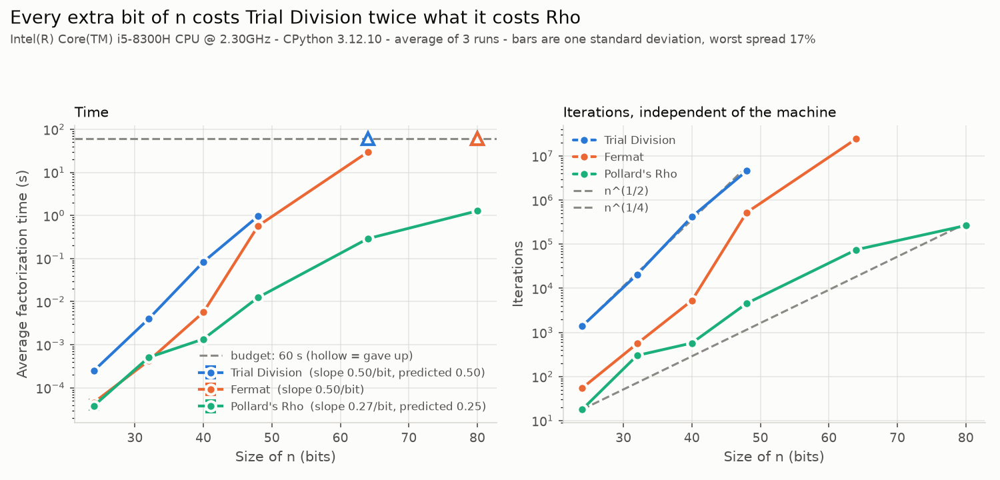
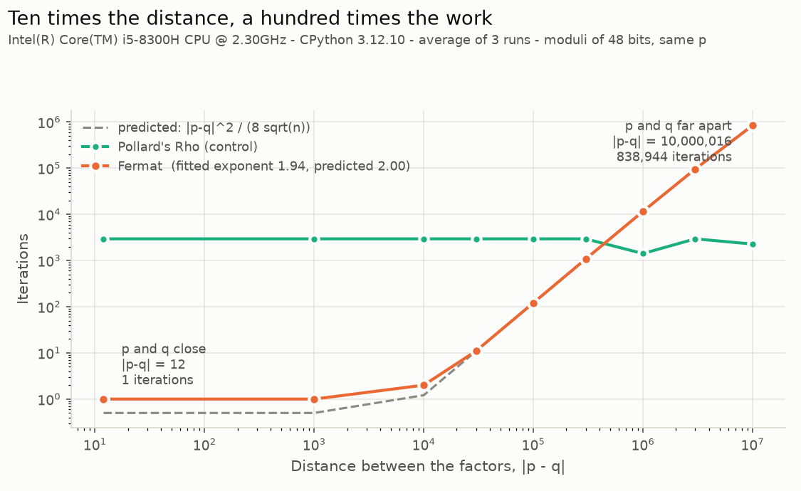
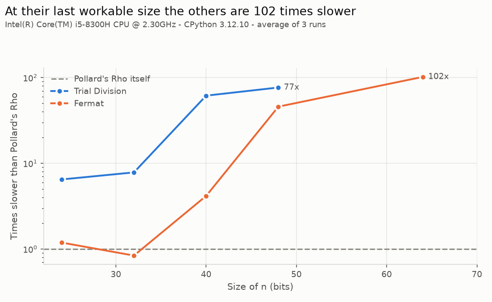

# Laboratory 4 — RSA factorization attacks

Three factorization algorithms — Trial Division, Fermat and Pollard's Rho —
implemented from scratch, used to recover an RSA private key from nothing but
the public values, and measured against each other on moduli from 24 to 80
bits.

No library factors anything here. `math.gcd`, `math.isqrt` and the
three-argument `pow(x, -1, m)` are not used in `factorlib` or `rsalib`: Euclid,
extended Euclid and an integer Newton square root are written out in
[`factorlib/arith.py`](factorlib/arith.py), and the standard-library versions
appear only inside the tests, as an independent oracle. No prime is
hard-coded either — the experimental moduli are generated at run time from a
fixed seed.

RSA itself is not re-implemented. Encryption and decryption *are*
`pow(m, e, n)` and `pow(c, d, n)`; the work of this laboratory is the
factorization, and the point of Part II is how little is left once it
succeeds.

---

## Language and dependencies

| | |
|---|---|
| Language | Python 3.12 |
| Tests | `pytest` |
| Figures | `matplotlib`, `numpy` |
| Core dependencies | none — `factorlib` and `rsalib` use only the standard library |

## Installation

```bash
git clone https://github.com/CipherTuring/Cryptography.git
cd Cryptography/rsa_lab_4
pip install -r requirements.txt
```

There is nothing to build. `conftest.py` puts the laboratory directory on
`sys.path`, so the packages import without being installed. Every command below
is run from inside `rsa_lab_4/`.

## Running the tests

```bash
python -m pytest tests/ -v
```

351 tests, about 5 seconds. They must all pass before the experimental
evaluation is run, which is the requirement of Exercise 5.

One layer at a time:

```bash
python -m pytest tests/test_arith.py -v             # gcd, modular inverse, isqrt
python -m pytest tests/test_trial_division.py -v    # Exercise 1
python -m pytest tests/test_fermat.py -v            # Exercise 2
python -m pytest tests/test_pollard_rho.py -v       # Exercise 3
python -m pytest tests/test_algorithms.py -v        # p*q == n, for all three
python -m pytest tests/test_keys.py -v              # encrypt/decrypt consistency
python -m pytest tests/test_recover_key.py -v       # Exercise 4, end to end
```

## Recovering the key (Exercise 4)

```bash
python -m attacks.recover_key
```

Factors `n = 3233` with all three algorithms, rebuilds the private key and
decrypts `c = 2790`:

```
Step 1 - factor n with the three algorithms
  Trial Division  p = 53, q = 61           27 iterations   0.000013 s
  Fermat          p = 53, q = 61            1 iterations   0.000009 s
  Pollard's Rho   p = 53, q = 61            3 iterations   0.000028 s
  The three algorithms agree: 3233 = 53 * 61

Step 2 - Euler's totient, which n alone does not reveal
  phi(n) = (p - 1)(q - 1) = 52 * 60 = 3120

Step 3 - invert the public exponent
  d = e^-1 mod phi(n) = 17^-1 mod 3120 = 2753

Step 5 - decrypt
  m = c^d mod n = 2790^2753 mod 3233 = 65

Step 6 - verify
  m^e mod n = 65^17 mod 3233 = 2790   (c = 2790)   OK
```

The assignment lists the expected factors as `p = 61, q = 53`; the pair is
reported ordered, since `n = pq` either way.

It works on any small modulus:

```bash
python -m attacks.recover_key --n 1005973 --e 17 --c 12345
```

## Using the library

```python
from factorlib import factor, ALGORITHM_ORDER
from rsalib import PublicKey, recover_private_key

result = factor(3233, "pollard-rho")
result.p, result.q, result.iterations        # (53, 61, 3)

public = PublicKey(n=3233, e=17)
private = recover_private_key(public, result.p, result.q)
private.decrypt(2790)                        # 65
```

All three algorithms share one signature, `(n, *, budget=None) -> FactorResult`,
and one set of exceptions: `NotFactorable` when no answer exists, and
`FactorizationTimeout` when a `Budget` runs out. That is what lets the
benchmark, the attack and the tests loop over them without special cases.

## Reproducing the experiments

```bash
python -m benchmarks.benchmark_factorization --quick   # seconds, checks the harness
python -m benchmarks.benchmark_factorization           # Exercise 6, about 4 minutes
python -m benchmarks.fermat_distance                   # Exercise 7, about 10 seconds
python -m benchmarks.plot_results                      # the three figures
```

Each experiment writes a readable `.txt` and a raw `.json` into
[`results/`](results/), both committed. The figures are drawn from the JSON and
never measure anything, so they can be regenerated at any time without the
numbers changing. Every modulus comes from a fixed seed, so a second run
measures the same inputs rather than different ones.

---

## Results

### Exercise 6 — time against the size of n

Intel Core i5-8300H, CPython 3.12.10, three repetitions per cell, 60 s budget.
Each cell is the average, followed by the standard deviation of those three
runs as a percentage of it.

| Bits | n | Trial Division | Fermat | Pollard's Rho |
|---|---|---|---|---|
| 24 | 11207579 | 248.9 us ± 2.1% | 45.6 us ± 12.9% | 38.4 us ± 17.3% |
| 32 | 2281072831 | 3.97 ms ± 2.9% | 425.4 us ± 2.7% | 507.1 us ± 1.4% |
| 40 | 871068058009 | 83.60 ms ± 1.5% | 5.66 ms ± 4.5% | 1.36 ms ± 2.9% |
| 48 | 151111553458787 | 961.34 ms ± 7.9% | 574.62 ms ± 2.1% | 12.54 ms ± 0.9% |
| 64 | 10282276023965890597 | timeout | 29.491 s ± 1.1% | 289.37 ms ± 1.0% |
| 80 | 626919093965434610154431 | timeout (not attempted) | timeout | 1.276 s ± 0.6% |

The spread is widest at 24 bits, where the whole measurement is a few tens of
microseconds and the clock's own resolution is a visible fraction of it. The
iteration counts below carry none of that noise: they are identical on every
run, because all three algorithms are deterministic here.

Iterations, which belong to the algorithm rather than to this machine:

| Bits | Trial Division | Fermat | Pollard's Rho |
|---|---|---|---|
| 24 | 1,399 | 55 | 18 |
| 32 | 20,506 | 556 | 300 |
| 40 | 419,559 | 5,287 | 574 |
| 48 | 4,595,577 | 523,323 | 4,555 |
| 64 | timeout | 24,558,747 | 75,072 |
| 80 | timeout (not attempted) | timeout | 265,743 |



Bars are one standard deviation. A cell that ran out of time is drawn as a
hollow marker on the budget line, not omitted: leaving it out would make Trial
Division look as if it improved at 80 bits.

### Exercise 7 — the distance between p and q

Nine moduli of 48 bits, all built from the same seed, so `p` is the same prime
throughout and only `q` moves. The two the assignment asks for:

| Case | n | distance | Fermat iterations | Fermat time |
|---|---|---|---|---|
| p and q close | 106486033108813 | 12 | 1 | 9.8 us |
| p and q far apart | 209678084385617 | 10,000,016 | 838,944 | 900.80 ms |

The full sweep, against the closed form `|p-q|² / (8√n)`:

| distance | Fermat iterations | predicted | Pollard's Rho (control) |
|---|---|---|---|
| 12 | 1 | 0 | 2,945 |
| 1,002 | 1 | 0 | 2,945 |
| 10,002 | 2 | 1 | 2,945 |
| 30,002 | 11 | 11 | 2,945 |
| 100,008 | 121 | 121 | 2,945 |
| 300,008 | 1,075 | 1,075 | 2,945 |
| 1,000,010 | 11,560 | 11,566 | 1,416 |
| 3,000,002 | 95,571 | 95,960 | 2,945 |
| 10,000,016 | 838,944 | 863,247 | 2,273 |



Fitted exponent **1.94**, against the 2.00 the algebra predicts. Pollard's Rho,
measured on the same moduli, shows no trend at all — which is what rules out
the moduli, rather than the method, as the cause.

---

## Experimental analysis

**1. How does the size of n affect Trial Division?**
It doubles the work every two bits. The search runs to √n = 2^(b/2), so the
fitted slope is 0.50 per bit against a predicted 0.50, and the iteration counts
multiply by about 16 every 8 bits: 1,399 → 20,506 → 419,559 → 4,595,577. At 64
bits it needs roughly 2³⁹ candidates and does not finish inside a minute. The
cost is exponential in the size of the key, which is why this method is a
teaching tool and not a threat.

**2. Why is Fermat efficient when p and q are close?**
Because it searches upwards from `a = ⌈√n⌉` and the answer is at
`a = (p+q)/2`. The distance between those two is
`|p−q|²/(8√n)` — quadratic in the gap. When the factors are 12 apart the first
candidate is already correct: one iteration. When they are ten million apart
the same modulus costs 838,944. Multiplying the distance by ten multiplies the
work by 98, measured. Fermat is not fast or slow in itself; it is the right
algorithm for a badly generated key and the wrong one for everything else.

**3. What role does the GCD play in Pollard's Rho?**
It is what makes an invisible collision readable. The sequence
`x ← x² + c mod n` repeats modulo the unknown factor `p` after about √p steps,
long before it repeats modulo `n`. When two positions collide modulo `p` but
not modulo `n`, their difference is a multiple of `p` and not of `n`, so
`gcd(|x−y|, n)` is `p` itself. Without the gcd the collision would be
undetectable, since `p` is exactly what we do not know. The same gcd also
reports failure: `d = n` means the positions collided modulo everything at
once, and the run restarts with a fresh `c`.

**4. Which algorithm performed better for the largest tested modulus?**
Pollard's Rho, and by a margin that widens with every bit. At 80 bits it is the
only one that answers at all, in 1.276 s and 265,743 iterations, while the
other two are over their budget. At 48 bits — the largest size all three
finish — it is 77 times faster than Trial Division and 46 times faster than
Fermat. The reason is the exponent: its cost is about n^(1/4) against Trial
Division's n^(1/2), measured at 0.27 per bit against a predicted 0.25.



Note that Fermat's advantage over Trial Division at 48 bits — 575 ms against
961 ms — is smaller than its own scaling would suggest, and for the reason
question 2 gives: the factors of that modulus are 7.2 million apart. An earlier
run of this same benchmark put the two the other way round, with Fermat at
964 ms ± 27%; the iteration counts were identical in both runs, so the
difference was machine noise, not the algorithm. It is the kind of conclusion a
table of bare averages would have hidden, which is why the dispersion is
printed next to every cell and drawn on every point.

**5. Why does recovering p and q break the RSA private key?**
Because `φ(n) = (p−1)(q−1)` is the only secret in the system, and it is a
subtraction away from the factors. Knowing `n` does not give `φ(n)`; knowing
`p` and `q` gives it immediately, and `d = e⁻¹ mod φ(n)` follows from one run of
extended Euclid. Everything after the factorization is microseconds:
`attacks/recover_key.py` spends its whole time in Step 1 and none of it in
Steps 2 to 6. RSA rests on a single hard step, and these three algorithms are
what happens when the modulus is small enough for that step to be easy.

---

## Layout

```
rsa_lab_4/
├── factorlib/        Part I — the three algorithms
│   ├── arith.py          gcd, modular inverse, integer square root
│   ├── result.py         FactorResult, Budget, the exceptions
│   ├── trial_division.py Exercise 1
│   ├── fermat.py         Exercise 2
│   ├── pollard_rho.py    Exercise 3
│   └── api.py            the registry that makes them interchangeable
├── rsalib/           Part II — key recovery
│   ├── keys.py           totient, private exponent, encrypt, decrypt
│   └── keygen.py         reproducible moduli, by size and by distance
├── attacks/
│   └── recover_key.py    Exercise 4
├── benchmarks/       Parts IV and V
│   ├── benchmark_factorization.py  Exercise 6
│   ├── fermat_distance.py          Exercise 7
│   └── plot_results.py             the figures
├── tests/            Part III — Exercise 5
└── results/          committed tables and figures
```
